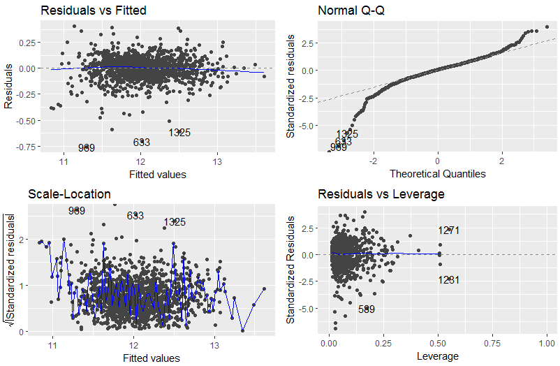
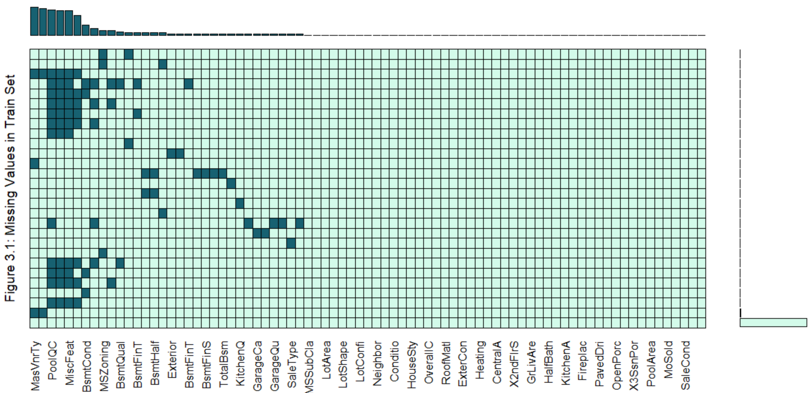
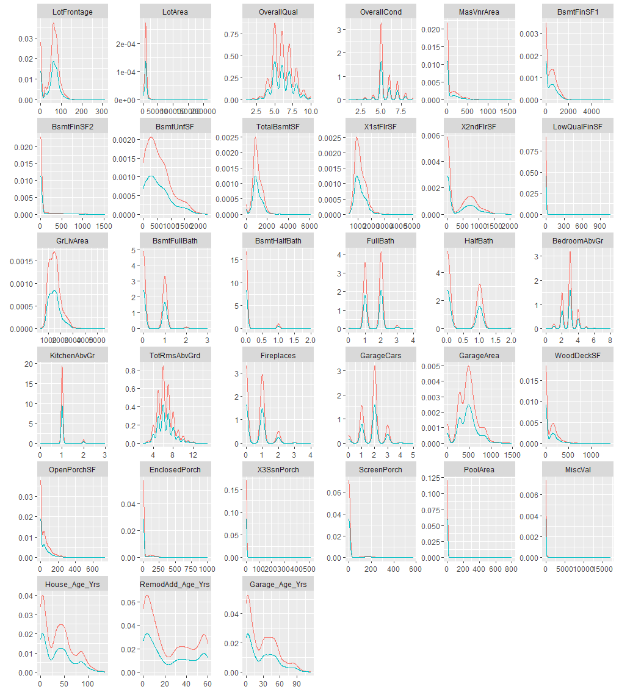
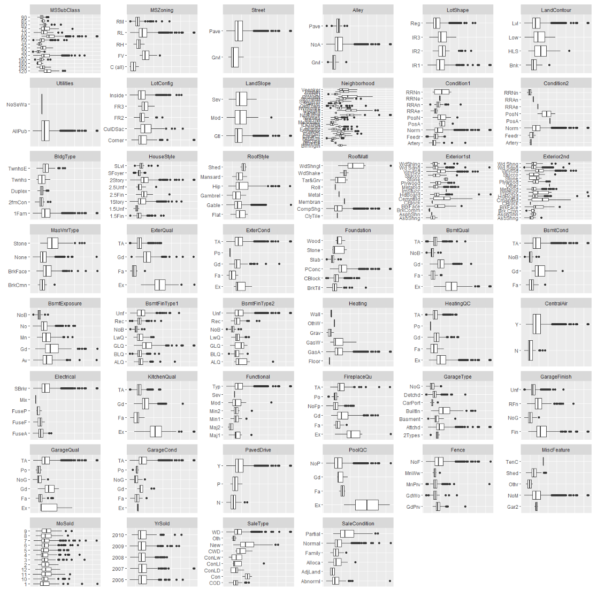
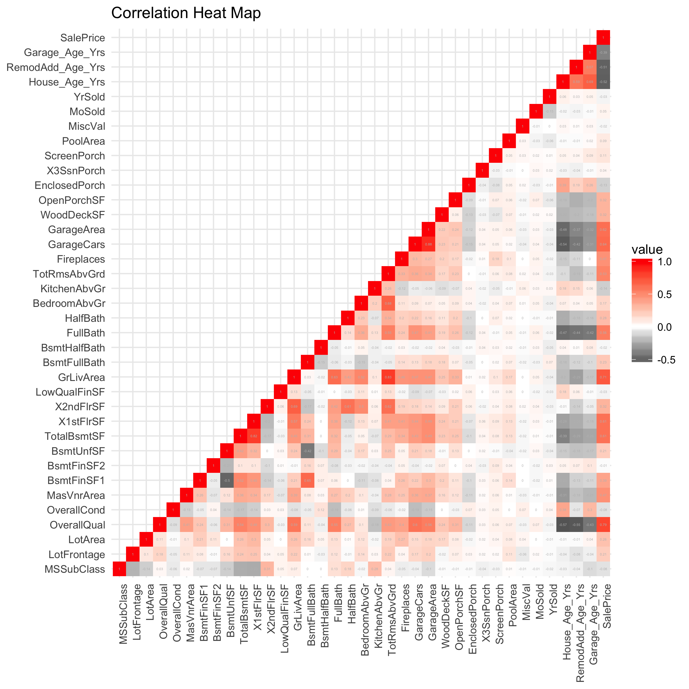
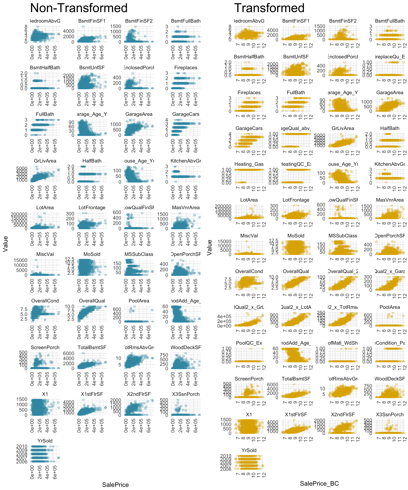
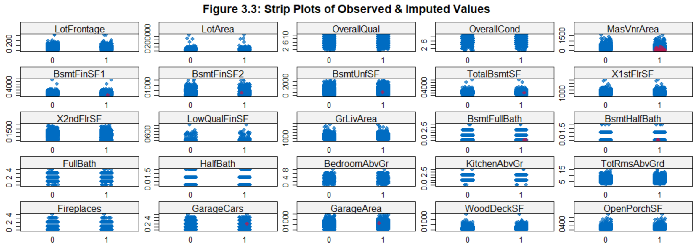

```{r options_pkgs, echo=F, warning=F, message=F, results=F}
knitr::opts_chunk$set(error = F, message = F, # tidy = T,
                      cache = T, warning = T, 
                      results = 'hide', # suppress code output
                      echo = F,         # suppress code
                      fig.show = 'hide' # suppress plots
                      )

library(RCurl)
library(knitr)
library(knitcitations)
library(pander)
```


> "The best investment on earth is earth." **-Louis Glickman**  


# Abstract

The real estate market in an important aspect in people life. From the dream of owning a home to using it as a security during tough times, real estate has been a part of our lives from generations. Price of real estate is important when buying home. For example, if we are buying house as an investment they we would want to buy when the prices are low.  

So how exactly are real estate prices determined? Understanding what factors drive sale prices is both interesting and important. In this project we use the popular Iowa housing data set to investigate which factors influence the final sale price. There were many features that we used when considering this research. Amoung those were location, condition, size etc.


# Key Words

Real Estate, Investment Home, Home Prices, Assessed Value, Regression, Linear Models

# Introduction

Real estate is property consisting of land and the buildings on it, along with its natural resources such as crops, minerals or water. Residential real estate may contain either a single family or multifamily structure that is available for occupation or for non-business purposes. Residences can be classified by and how they are connected to neighbouring residences and land. Different types of housing tenure can be used for the same physical type. For example, connected residences might be owned by a single entity and leased out, or owned separately with an agreement covering the relationship between units and common areas and concerns.

Apartment, Multi-family house, Terraced house, Condominium, Cooperative, Duplex etc are some categories of residential realestate. We found it interesting to study the real-estate market because this market this is a dynamic market and there are many factors that has influence over it. The dataset had many features to work with.   

The data set was prepared by Dean De Cock in an effort to create a real-world data set to test and practice regression methods [@DeCock]. It describes the sale of individual residential properties in Ames, Iowa from 2006 to 2010. Founded in 1864 as a station stop, Ames has a population of approximately 60,000 people, covers about 24.27 square miles and was ranked ninth on the *Best Places to Live* list [@CNNMoney]. The original data came directly from the Ames Assessor's Office recordkeeping database and included information for calculation of assessed value using the city's assessment process. The data is recent, and it covers the period of housing bubble collapse that led to the sub-prime mortgage crisis. The year 2008 saw one of the largest housing price drops in history.

There are over 2900 total observations and the data represents attribute of an individual residential property sold. There are about 80 variables included that cover a multitude of property attributes. Most variables describe the physical appearance or features of the property but other variables provide measures of quality and condition. The data types are varied and include discrete, continuous, and categorical (both nominal and ordinal) data.

The data was originally published in the Journal of Statistics Education (Volume 19, Number 3). The data used for regression was downloaded from Kaggle.com, which allowed us the opportunity to compete against other kaggle users to find the best-fitting model for this data [@Kaggle].
 
# Literature Review

The paper from MIT Press, "The Dynamics of Real Estate Prices" presents an improved methodology which combines information on repeat sales of unchanged properties, on repeat sales of improved properties, and on single sales, all in one joint estimation. Empirical evidence, based upon a rich sample of transactions on single family houses in a single neighborhood, indicates the clear advantages of the proposed methodology, at least in one typical application.

The article "A Regression Method for Real Estate Price Index Construction" explains that the quality differences make estimation of price indexes for real properties difficult, but these can be largely avoided by basing an index on sales prices of the same property at different times. The problem of combining price relatives of repeat sales of properties to obtain a price index can be converted into a regression problem, and standard techniques of regression analysis can be used to estimate the index. This method of estimation is more efficient than others for combining price relatives in that it utilizes information about the price index for earlier periods contained in sales prices in later periods. Standard errors of the estimated index numbers can be readily computed using the regression method, and it permits certain effects on the value of real properties to be eliminated from the index.

The article "Understanding Recent Trends in House Prices and Home Ownership" by Robert J. Shiller looks at a broad array of evidence concerning the recent boom in home prices, and considers what this means for future home prices and the economy. It does not appear possible to explain the boom in terms of fundamentals such as rents or construction costs. A psychological theory, that represents the boom as taking place because of a feedback mechanism or social epidemic that encourages a view of housing as an important investment opportunity, fits the evidence better.

# Methodology  

### Data Description  

There are 2,910 observation and 79 independent variables in this dataset. Out of those 36 are numeric, such as lot area or pool area in square feet, and 43 are categorical, such as garage type (attached to home, built-in, carport, etc.) or utilities (gas, sewer, both, etc.). The data set is split into 1,460 observations comprising the training set and 1,459 observations representing the testing set.

### Data Imputation  

Many real-world datasets may contain missing values for various reasons. They are often encoded as NaNs, blanks or any other placeholders. Training a model with a dataset that has a lot of missing values can drastically impact the machine learning model’s quality. Some algorithms such as scikit-learn estimators assume that all values are numerical and have and hold meaningful value. One way to handle this problem is to get rid of the observations that have missing data. However, you will risk losing data points with valuable information. A better strategy would be to impute the missing values. In other words, we need to infer those missing values from the existing part of the data. 

**Three main types of missing data** 

- Missing completely at random (MCAR)
- Missing at random (MAR)
- Not missing at random (NMAR)

**Common Imputation Techniques**

- Do Nothing
- Imputation Using (Mean/Median) Values
- Imputation Using (Most Frequent) or (Zero/Constant) Values
- Imputation Using k-NN
- Imputation Using Multivariate Imputation by Chained Equation (MICE)
- Imputation Using Deep Learning (Datawig)

Example: Multivariate Imputation by Chained Equation (MICE)

```
from impyute.imputation.cs import mice

# start the MICE training
imputed_training=mice(train.values)
```


Original data set included no complete observations (*see table 3*). However, according to the data dictionary, many of the`NA` values have a specific meaning. For example, `NA` in the `PoolQC` variable (pool quality) implies that the property has no pool. Often this logic carried across multiple variables - for example, `NA` in `GarageQual` (garage quality), `GarageCond` (garage condition) and `GarageType` variables all indicate that the property has no garage. This type of missing value was replaced with a new category - *No Pool*, *No Garage* or similar. 

After this substitution the number of complete observations increased significantly to 2,861 or about 98% of all observations. There remained only 58 observations with true missing values. These observations contained 180 missing values in 32 variables. None of the variables contained a large number of missing values. The top one was `MasVnrType` with 24 observations containing `NA` (0.8% of all observations). None of the variables were close to the 5% missing threshold that would suggest that we should drop them from analysis.

In addition to the quantity of missingness being important, why and how the values are missing can give us insight into whether we have a biased sample. There are three types of missing data [@faraway]: 1) Missing Completely at Random (MCAR), 2) Missing at Random (MAR), and 3) Missing Not at Random (MNAR). MCAR is when the probability of missingness is the same for all cases. This is the ideal type of missingness because we could delete these cases without incurring bias. MAR occurs when the probability of a value being missing depends upon a known mechanism. In this scenario, we could delete these observations and compensate by weighting by group membership. Finally, MNAR occurs when the values are missing because of an unknown variable. This is the type of missingness that is most likely to bias our sample. Faraway asserts that ascertaining the exact nature of the missingness is not possible and must be inferred. Figure 2 displays the combinations of missing values in the predictor variables. We may not have MCAR because we can see that the missingness is not more dispersed across all variables and  cases. Only 32 of the 79 predictors have a missing value, and we notice that the missingness occurs most often in some of the masonry, basement and garage variables. There is no indication that values are missing not at random and given the small number of missing values, we believe the bias, if any, will be limited.


### Data Preparation

Data preparation is the process of cleaning and transforming raw data prior to processing and analysis. It is an important step prior to processing and often involves reformatting data, making corrections to data and the combining of data sets to enrich data. Data preparation is often a lengthy undertaking for data professionals or business users, but it is essential as a prerequisite to put data in context in order to turn it into insights and eliminate bias resulting from poor data quality. For example, the data preparation process usually includes standardizing data formats, enriching source data, and/or removing outliers.

Categorical variables were inspected and their order was changed to match the most likely low-to-high order. These variables for the most part do not rely on the order of categories, so this step was not critical to modeling; however, it makes the modeling output more readable and easier to interpret.

As is the case with most data sets, we found several values that were clearly typos and input errors. For instance, one observation had the year when garage was built listed as 2207. During data preparation we noticed some negative values which did not make sense, for example age etc. They were set to 0.


```{r NA Review}
naVars <- read.csv(paste0("https://raw.githubusercontent.com/kaiserxc/DATA621FinalProject/",
                          "master/report_files/table1_na_vars.csv"))
naVars <- naVars[,2:4]
colnames(naVars) <- c("Variable", "No of NAs", "Percent of Total Obs")
pander(head(naVars, 10), keep.trailing.zeros=TRUE, 
       caption="Number of NA values in original data (10 records)",
       justify=c("left", "right", "right"))
```


### Data Transformation

Data transformation is the process of changing the format, structure, or values of data. For data analytics projects, data may be transformed at two stages of the data pipeline. Organizations that use on-premises data warehouses generally use an ETL (extract, transform, load) process, in which data transformation is the middle step. Today, most organizations use cloud-based data warehouses, which can scale compute and storage resources with latency measured in seconds or minutes. The scalability of the cloud platform lets organizations skip preload transformations and load raw data into the data warehouse, then transform it at query time — a model called ELT ( extract, load, transform).

Processes such as data integration, data migration, data warehousing, and data wrangling all may involve data transformation. Data transformation may be constructive (adding, copying, and replicating data), destructive (deleting fields and records), aesthetic (standardizing salutations or street names), or structural (renaming, moving, and combining columns in a database). There are many ETL tools that automate the process of data transformation. Data analysts, data engineers, and data scientists also transform data using scripting languages such as Python or domain-specific languages like SQL.

Prior to modeling, we have extensively analyzed available variables and took a few approaches to variable transformations. They were meant to both simplify existing variables and add new variables that may be helpful in modeling. 

Generally, it is more common to think about the age of the house than the year it was built. Each age related variable was stored in the data set in two related variables - year built and year sold. Rather than trying to work with original variables we have converted them to a single *age* variable. For house age the value was $YrSold - YearBuilt$. Similarly the age of the garage and last remodeling was added to the data set, and the original year variables were dropped.

Because we are not dealing with a time series data set, we have converted `YrSold` and `MoSold` variables from numeric to nominal. It is important to catch seasonality, but does not make sense to regress on these features as continuous variables.

Using the side-by-side box plots in Figure 4, we examined the categorical variables with more than two values to see if the variable can be simplified by combining the values into two groups. Our criteria for this simplification was if the variables' inner quartile ranges of the response variable distinctly and logically bifurcate. For example, in `FireplaceQu` (fireplace quality), `HeatingQC` (heating quality) and `PoolQC` (pool quality), we noticed that the inner quartiles are bifurcated into two groups that do not overlap: the highest *Excellent* value and all other lesser quality conditions. Additional values that are distinct from other values in the same variables are the *Wood Shingle* value in the roof material variable (`RoofMat1`), the above average values in the garage quality variable (`GarageQual`), the gas-related values in the heating variable (`Heating`), and the *Partial* value in the sale condition variable (`SaleCondition`). Consequently, we transformed these into dummy variables with appropriate names. This allowed us to preserve some degrees of freedom that would otherwise be subtracted if each and every one of the original values were turned into dummy variables.

```{r Correlations1}
top_corr <- read.csv(paste0("https://raw.githubusercontent.com/kaiserxc/DATA621FinalProject/",
                            "master/report_files/table3_top_corr.csv"))
colnames(top_corr) <- c("Predictor Variable", "Response Variable", "Correlation", "R^2")
pander(top_corr, keep.trailing.zeros=TRUE, 
       caption="Predictor variables most correlated with original response variable.",
       justify=c("left", "left", "right", "right"))
```

```{r Correlations2}
tran_corr <- read.csv(paste0("https://raw.githubusercontent.com/kaiserxc/DATA621FinalProject/",
                            "master/report_files/table4_top_transform.csv"))
colnames(tran_corr) <- c("Response Variable", "Predictor Transformation", "Correlation", "R^2")
pander(head(tran_corr, 10), keep.trailing.zeros=TRUE, caption="Predictor transformations most correlated with transformed response variable (10 records)", justify=c("left", "left", "right", "right"))
```

We examined whether our modeling would benefit from transforming any of the predictor variables. To do so, we have automated creation of several different versions of the predictor variables using `R`. We took natural logarithms, square roots and squares of the numerical variables, and then we calculated every possible pairwise interaction between these transformations, the original numerical variables and categorical variables. We then calculated all pairwise correlations between the interactions and the response variable `SalePrice`. The top correlations can be seen in table 6, which is sorted in descending order by R-squared. We observed that there are several correlation values higher than the highest correlation between the original predictors and the response, which is `OverallQual` at 0.79 (*see table 5*). The most promising transformations involved taking the square of `OverallQual` and multiplying it by the log-transformed or square-root-transformed area variables. We added the top five interactions to our training data set.

We have created several potential training sets to give use flexibility in training the model. The **first** of the three training data sets we created includes only the original variables with the missing values imputed. In model building and selection this set is referred to as the *original* data set. The **second** training data set includes seven "simplified" dummy variables instead of original variables. It also includes the five highly-correlated interactions. This set is referred to as the *transformed* data set. The **third** training data set includes the same predictor variables as in the second set with a transformed response variable. While creating all interactions, we noticed that the correlation values appeared to increase vis-a-vis the square root of the response variable. Consequently, since the response variable contains only positive values, we created a simple BIC step model and used it to calculate the Box-Cox $\lambda$ value and transform the response variable. According to Box-Cox, a $\lambda$ value of approximately 0.184 should help the final model meet the normality assumption. This set is referred as the *Box-Cox* data set.

The effects of this transformation can be see in the scatter plots of the independent variables on `SalePrice`. The trends are more decernable in the transformed data and the relations are generally more linear (*see figure 6*). 

### Modeling  

Data modeling is the process of producing a descriptive diagram of relationships between various types of information that are to be stored in a database. One of the goals of data modeling is to create the most efficient method of storing information while still providing for complete access and reporting.

For this research we relied on building and optimizing general linear model because we are dealing with continuous variable i.e. house sale price.

After fitting three baseline models to all three training data sets, ANOVA demonstrated statistical significance between the original data set and the transformed data set. While all multiple $R^2$ values were within some negligible deviation of each other, adding a Box-Cox transformation of the response variable improved the $R^2$ beyond the model based on the original data set. 

We took the strongest model, and applied step-wise regression. Since we started with the baseline model containing all variables we applied backward elimination in order to settle on a model with the lowest Akaike information criterion (AIC) value.

For the variables that were not transformed, we used log-transformation as it tends to bring sales data closer to normal distribution.


Models used in this research:

- **Model 1** is based on the fully transformed data set with Box-Cox transformed response variable. It includes all available predictor variables including any interactions created in data preparation. This model explains nearly 94% of variability of the response variable. A good starting point, but we can remove some insignificant variables for a more parsimonious model with a decreased risk of overfitting.

- **Model 2** is based on Model 1 modified with step-wise regression (backward elimination). It is an improvement with lower number of parameters (156 comparing to 237). The multiple $R^2$ value is similar. Comparing two models using ANOVA indicates that they are not significantly different.

- **Model 3** selects only statistically highly significant variables from the previous model (p-value is nearly 0). $R^2$ drops and F-statistic rises, so even though the model is simpler with only 58 parameters, it may not be an improvement. Comparing this model with the first one using ANOVA, shows that there is significant difference between the two.

- **Model 4** expands on the previous model by using statistically significant variables, but with less strict criteria (p-value < 0.01). The number of parameters is increased, but $R^2$ is also increased. Similarly, per ANOVA, this model is significantly different from models 1 and 3.

- **Model 5** takes variables identified in the previous model, but it is trained on the original data set without interactions. It uses only log-transformation of `LotArea` predictor variable and `SalePrice` response variable. This model represents the best results based on $R^2$ for any model we have tried using the original data set.

- **Model 6** is based on Model 4, but it is trained on the transformed data set that includes interactions, but not the Box-Cox transformation of the response variable. Similarly to model 5, this model uses log-transformed `LotArea` and `SalePrice`. 

For all models the F-statistic's p-value shows a drastic improvement over an intercept-only model, so we can infer that these models are statistically significant.

The table below summarizes the models. We can see a steady improvement in AIC numbers for models 1 through 6. Adjusted $R^2$ fluctuates, but it remains high, and the values are close between various models. The fluctuation in $R^2$ is not enough to be the deciding factor in selecting a model.

```{r Models Summary, echo=F, eval=T, results=T}
models <- read.csv(paste0("https://raw.githubusercontent.com/kaiserxc/DATA621FinalProject/",
                          "master/report_files/embedded_table1_models.csv"))
colnames(models) <- c("Model", "Multiple R^2", "Adjusted R^2", "AIC", "Kaggle Score")
pander(models, caption="",
       digits=4, emphasize.rownames=FALSE, keep.trailing.zeros=TRUE, 
       justify=c("left", "right", "right", "right", "right"))
```


Since the data set comes from Kaggle, we have an easy way to evaluate our models by predicting the sale price for the testing set and submitting our predictions. Kaggle provides a score that lets you judge the performance of our models. We submitted predictions from models 5 and 6. Model 6 was a clear favorite. 

Models 1 through 4 rely on the Box-Cox transformation of the response variable with $\lambda$ value of 0.184. Although this may slightly improve a model, it makes conversion of prediction difficult and confusing. Log-transformation of the response variable used by models 5 and 6 is significantly easier to implement. As such slight improvement of the Box-Cox model is not enough to justify added complexity of making predictions. It is important to consider how the model will be implemented and simplicity matters. 

Model 6 is our primary linear regression model to predict house sale prices. 

The model was tuned using k-fold validation (with 10 folds). It was run through full diagnostic and four leverage points have been identified. These observations were removed from the training set as it is very plausible that the sales data set has some uncharacteristic outliers.

Additionally, two categorical variables - `Condition2` and `Utilities` - were removed from the model because they did not have enough samples in each category. These variables may be meaningful for predicting the response variable, but there is not enough information in our small data set for these variable to train on. 

The final model had multiple $R^2$ of 0.9276, adjusted $R^2$ of 0.9225, AIC of -2172 and Kaggle score of 0.13376. These are the best values in all categories.

Figure 1 shows the model diagnostics. There is no discernible pattern among residuals. The Q-Q plot shows some problems with distribution tails; however, this is not unexpected with sales data - there are bound to be some really good and some really bad deals out there. Major leverage points have been accounted for. 

Data preparation and transformation, including response variable transformation, model building and re-building as well as model diagnostics resulted in a linear regression model to predict house sale prices.




# Experimentation and Results

Having developed a model and successfully tested it against available test data, we can now review the results. 

Our model has 98 parameters. The majority of those are dummy variables created for categorical variables. Table 2 lists all parameters and corresponding coefficients. Please note that our response variable is log-transformed, so coefficients will only give a general idea of the impact on the sale price, and not a specific amount. 

Linear regression takes the following form:

\begin{center}
$\hat{y} = \beta_0 + \beta_1 x_1 + ... + \beta_p x_p + \epsilon$
\end{center}

Here, $\hat{y}$ is the predicted outcome, $x_1$ through $x_p$ are selected parameters, $\beta_1$ through $\beta_p$ are corresponding coefficients, $\beta_0$ is the intercept and $\epsilon$ is the error or noise term. We have too many parameters to efficiently write out our linear model; however, using the coefficient table we can easily assemble the final formula if desired. The formula used in `R` is as follows:

```{r LM Formula, eval=F, echo=T}
log(SalePrice) ~ OverallCond + Condition1 + MSZoning + X1stFlrSF + X2ndFlrSF + 
  LowQualFinSF + Neighborhood + KitchenQual + Fireplaces + WoodDeckSF + 
  Functional + FullBath + BsmtFullBath + BsmtFinType1 + BsmtExposure + BsmtQual +
  LandSlope + LandContour + log(LotArea) + LotFrontage + LotConfig + HouseStyle + 
  RoofStyle + MasVnrArea + ScreenPorch + House_Age_Yrs + RoofMatl_WdShngl +
  GarageQual_abv_avg + OverallQual2_x_GrLivArea + OverallQual2_x_TotRmsAbvGrd_log + 
  OverallQual2_x_GarageCars
```

```{r Coef Summary, echo=F, eval=T, results=T}
coef <- read.csv(paste0("https://raw.githubusercontent.com/kaiserxc/DATA621FinalProject/",
                        "master/report_files/embedded_table2_coef.csv"))


pander(head(coef[,1:3], 10), caption="Linear model parameters and coefficients (sorted by category and coefficient). (10 records)", emphasize.rownames=FALSE, keep.trailing.zeros=TRUE, justify=c("left", "left", "right"))
```

The attribute with the most negative effect on the sale price is severely damaged functionality of the house. Major deductions in functionality (a step above *Severely Damaged*) is also included in the top five negative attributes. Interestingly, typical functionality has one of the most positive influences on the sale price. Clearly and not surprisingly, general house condition that ranges from *Typical* to *Salvage Only*, is very important to the final sale price. 

Another attribute that influences the sale price negatively is the Meadow Village neighborhood. Reviewing Ames, Iowa information, we can quickly notice that the Meadow Village despite its peaceful name is actually on the edge of town next to the airport. This would be a less desirable neighborhood in any town. On the opposite side of town, next to a golf club and to the Ada Hayden Heritage park and lake, is the Stone Brooke neighborhood. This is one of the most positive attributes. Again not surprisingly, the most positive and negative neighborhoods are on completely opposite sides of town. 

Other major negative attributes are lack of finished basement and fair quality of kitchen. Zoning attributes make up other major positive attributes. 

The model confirms a few attributes that can be considered common sense. For example, location adjacent to the railroad has a negative influence on the sale price. However, this only applies to the East-West railroad. The impact of the North-South railroad is positive. It is important to note that the East-West railroad cuts through the middle of the town while the North-South railroad only affects a small portion, and it is clearly a less used railroad. 

Other notable factors are the following:

- House age has a negative influence, but not as great as some other attributes. 
- Being on a cul-de-sac is the most positive lot location. Inside lot has a slightly negative effect, and a lot with streets on 2 sides has even more negative coefficient. Finally, a lot with streets on 3 sides has the biggest negative impact. 
- An unfinished basement generally has a negative impact as does a low-quality kitchen. 
- The square footage of several characteristics, such as first or second floor, wood deck, porch, is not important (but the impact is slightly positive).
- 1.5 and 2.5 story houses seem to be preferred; however, this variable is probably highly dependent on the type of houses available in Ames, and it could be representative of some other features.


# Discussion and Conclusion  

Location and condition seem to be major attributes in house sale prices. There is seasonality to number of houses sold, especially considering that Ames is a college town; however, it does not appear to be a major factor. 

The biggest limiting factor of our study is that it is based on one Midwest town's data. This model may not transfer well to other locations. After all it is not hard to imagine that the driving factors in Ames, Iowa are quite different from factors in New York, NY or Los Angeles, California. It is a helpful starting point, but may not be widely applicable. 

Our research is based exclusively on linear regression. Other methods, such as Support Vector Machines or Random Forrest, may be able to achieve much better results. This data set provides a rich opportunity for research, and it would be beneficial to try other methods for comparison purposes.

```{r Summary Stats Numeric}
stat_tbl <- read.csv(paste0("https://raw.githubusercontent.com/kaiserxc/DATA621FinalProject/",
                            "master/report_files/table2_stats.csv"))
colnames(stat_tbl) <- c("Variable", "Count", "Mean", "SD", "Median", "Min", "Max", "Kurtosis")
pander(head(stat_tbl, 10), caption="Descriptive statistics for numerical variables (10 records)",
       digits=4, emphasize.rownames=FALSE,
       justify=c("left", "right", "right", "right", "right", "right", "right", "right"))
```

\newpage
# Appendix A. Figures


\begin{center}
Figure 2. Missing values.
\end{center}


\begin{center}
Figure 3. Density plots of observed (blue) and imputed (red) values.
\end{center}


\begin{center}
Figure 4. Box plots of categorical variables against the response variable.
\end{center}


\begin{center}
Figure 5. Correlation heat map.
\end{center}


\begin{center}
Figure 6. Scatter plots of original and transformed variables.
\end{center}


\begin{center}
Figure 6. Scatter plots of original and transformed variables.
\end{center}


```{r Plots, ref.label=c("Figure1", "Figure2"), echo=F, fig.show="asis"}
```

\newpage
# Appendix B. Tables

```{r Table1, ref.label="NA Review", echo=F, eval=T, results=T}
```

\newpage
```{r Table2, ref.label="Summary Stats Numeric", echo=F, eval=T, results=T}
```

\newpage
```{r Table1, ref.label="Correlations1", echo=F, eval=T, results=T}
```

```{r Table1, ref.label="Correlations2", echo=F, eval=T, results=T}
```

\newpage
# Appendix C. `R` Code

```{r Code, echo=T, eval=F}
install_load <- function(pkg){
  new.pkg <- pkg[!(pkg %in% installed.packages()[, "Package"])]
  if (length(new.pkg)) install.packages(new.pkg, dependencies = TRUE)
  sapply(pkg, require, character.only = TRUE, quietly = TRUE, warn.conflicts = FALSE)
}

# required packages
packages <- c("tidyverse","knitr",  "mice", "VIM", "RCurl", "knitcitations", "janitor", "missForest", "DMwR", "splitstackshape", "car")

#install_load(packages)

# Read data
url_train <- "https://raw.githubusercontent.com/monuchacko/cuny_msds/master/data_621/FinalProject/finalprojectpaper/data/train.csv"
url_test <-  "https://raw.githubusercontent.com/monuchacko/cuny_msds/master/data_621/FinalProject/finalprojectpaper/data/test.csv"

stand_read <- function(url){
  return(read.csv(text = getURL(url)))
}

o_train <- 
  stand_read(url_train) %>% 
  mutate(d_name = 'train')
o_test <- stand_read(url_test) %>% 
  mutate(SalePrice = NA, d_name = 'test')

full_set <- rbind(o_train, o_test)

na_review <- function(df){
  # returns df of vars w/ NA qty desc.
  na_qty <- colSums(is.na(df)) %>% as.data.frame(stringsAsFactors=F)
  colnames(na_qty) <- c("NA_qty")
  na_qty <- cbind('Variable' = rownames(na_qty), na_qty) %>% 
    select(Variable, NA_qty)
  rownames(na_qty) <- NULL
  
  na_qty <- na_qty %>% 
    arrange(desc(NA_qty)) %>% filter(NA_qty > 0) %>% 
    mutate(Variable = as.character(Variable)) %>% 
    mutate(Pct_of_Tot =  round(NA_qty/nrow(df), 4) * 100)
  
  return(na_qty)
}

first_pass <- 
  full_set %>% 
  # first_pass is train.csv and test.csv combined for NA reviews 
  # and imputation planning and calculated columns
  mutate(House_Age_Yrs = YrSold - YearBuilt, 
         RemodAdd_Age_Yrs = YrSold - YearRemodAdd, 
         Garage_Age_Yrs = YrSold - GarageYrBlt) 

naVars <- na_review(first_pass %>% select(-SalePrice))
naVars


set_aside <- c(2600, 2504, 2421, 2127, 2041, 2186, 2525, 1488, 949, 2349, 2218, 2219, 333)
set_asideA <- '2600|2504|2421|2127|2041|2186|2525|1488|949|2349|2218|2219|333' # 13
set_asideB <- '|2550|524|2296|2593' # negative values in '_Age' columns

x <- first_pass %>% 
  # exclude set_aside observations to fill in known NA's
  filter(!grepl(paste0(set_asideA, set_asideB), Id))
  
naVarsx <- na_review(x %>% select(-SalePrice))
naVarsx

obtain_data <- function(df){
  # like first_pass but with imputation that addresses observations that have known NA's
  df %>%
    mutate(PoolQC = fct_explicit_na(PoolQC, na_level='NoP'),
           MiscFeature = fct_explicit_na(MiscFeature, na_level='NoM'),
           Alley = fct_explicit_na(Alley, na_level='NoA'),
           Fence = fct_explicit_na(Fence, na_level = 'NoF'),
           FireplaceQu = fct_explicit_na(FireplaceQu, na_level = 'NoFp'), 
           LotFrontage = ifelse(is.na(LotFrontage), 0, LotFrontage),
           
           # Note GarageYrBlt set to 9999 may be a problem
           GarageYrBlt = ifelse(is.na(GarageYrBlt), 9999, GarageYrBlt), 
           GarageFinish = fct_explicit_na(GarageFinish, na_level = 'NoG'), 
           GarageQual = fct_explicit_na(GarageQual, na_level = 'NoG'), 
           GarageCond = fct_explicit_na(GarageCond, na_level = 'NoG'), 
           # NOTE: Garage_Age_Yrs: 0 doesn't seem appropriate... 
           Garage_Age_Yrs = ifelse(is.na(Garage_Age_Yrs), 0, Garage_Age_Yrs),
           GarageType = fct_explicit_na(GarageType, na_level = 'NoG'), 
          
           BsmtQual = fct_explicit_na(BsmtQual, na_level = 'NoB'),
           BsmtCond = fct_explicit_na(BsmtCond, na_level = 'NoB'),
           BsmtExposure = fct_explicit_na(BsmtExposure, na_level = 'NoB'),
           BsmtFinType1 = fct_explicit_na(BsmtFinType1, na_level = 'NoB'),
           BsmtFinType2 = fct_explicit_na(BsmtFinType2, na_level = 'NoB')
           )
}

probl_obs <- full_set %>% 
  mutate(House_Age_Yrs = YrSold - YearBuilt, 
         RemodAdd_Age_Yrs = YrSold - YearRemodAdd, 
         Garage_Age_Yrs = YrSold - GarageYrBlt) %>% 
  filter(grepl(paste0(set_asideA, set_asideB), Id))

known_obs <- full_set %>% 
  filter(!grepl(paste0(set_asideA, set_asideB), Id)) %>% 
  mutate(House_Age_Yrs = YrSold - YearBuilt, 
         RemodAdd_Age_Yrs = YrSold - YearRemodAdd, 
         Garage_Age_Yrs = YrSold - GarageYrBlt)


full_set_clean <- rbind(obtain_data(known_obs), probl_obs) %>% arrange(Id)
str(full_set_clean)

#View(full_set_clean)
#summary(full_set_clean)
naVarsy <- na_review(full_set_clean %>% select(-SalePrice))
sum(naVarsy$NA_qty) # 176

# ord_vars per the Data Dictionary.  
ord_vars <- c("LotShape","Utilities", "LandSlope", "ExterQual", 
              "ExterCond", "BsmtQual", "BsmtCond", "BsmtExposure",
              "BsmtFinType1", "BsmtFinType2", "HeatingQC", "Electrical",
              "KitchenQual", "Functional", "FireplaceQu", "GarageFinish",
              "GarageQual", "GarageCond", "PavedDrive", "PoolQC", "Fence")

# Order of levels for ordinal variables 
# all are ordered most favorible to least favorible, below
LotShape_ <- c("Reg", "IR1", "IR2", "IR3")        # needs repair
Utilities_ <- c("AllPub", "NoSeWa")               # ok - No "NoSewr", "ELO"
LandSlope_ <- c("Gtl","Mod", "Sev")               # ok
ExterQual_ <- c("Ex", "Gd", "TA", "Fa")           # needs repair - No "Po"

ExterCond_ <- c("Ex", "Gd", "TA", "Fa", "Po")     # needs repair
BsmtQual_ <- c("Ex", "Gd", "TA", "Fa", "NoB")     # needs repair
BsmtCond_ <- c("Gd", "TA", "Fa", "NoB")           # needs repair
BsmtExposure_ <- c("Gd", "Av", "Mn", "No", "NoB") # needs repair

BsmtFinType1_ <- c("GLQ", "ALQ", "BLQ", 
                   "Rec", "LwQ", "Unf", "NoB")    # needs repair
BsmtFinType2_ <- c("GLQ", "ALQ", "BLQ", 
                   "Rec", "LwQ", "Unf", "NoB")    # needs repair
HeatingQC_ <- c("Ex", "Gd", "TA", "Fa", "Po")     # needs repair 
Electrical_ <- c("SBrkr", "FuseA", "FuseF",
                 "FuseP", "Mix")                  # needs repair

KitchenQual_ <- c("Ex", "Gd", "TA", "Fa")         # needs repair - no "Po"
Functional_ <- c("Typ", "Min1", "Min2", "Mod",
                 "Maj1", "Maj2", "Sev")           # needs repair - no "Sal"
FireplaceQu_ <- c("Ex", "Gd", "TA", "Fa", 
                  "Po", "NoFp")                   # needs repair
GarageFinish_ <- c("Fin", "RFn", "Unf", "NoG")    # ok

GarageQual_ <- c("Ex", "Gd", "TA", "Fa", "Po", 
                 "NoG")                           # needs repair
GarageCond_ <- c("Ex", "Gd", "TA", "Fa", "Po", 
                 "NoG")                           # needs repair
PavedDrive_ <- c("Y", "P", "N")                   # needs repair
PoolQC_ <- c("Ex", "Gd", "Fa", "NoP")             # needs repair - no "TA"
Fence_ <- c("GdPrv", "MnPrv", "GdWo", "MnWw",
            "NoF")                                # needs repair

# list of lists of the correct factor levels
n_levels <- list(LotShape_, Utilities_,  LandSlope_,  ExterQual_,  
                 ExterCond_,  BsmtQual_,  BsmtCond_,  BsmtExposure_, 
                 BsmtFinType1_,  BsmtFinType2_,  HeatingQC_,  Electrical_, 
                 KitchenQual_,  Functional_,  FireplaceQu_,  GarageFinish_, 
                 GarageQual_,  GarageCond_,  PavedDrive_,  PoolQC_,  Fence_)
names(n_levels) <- ord_vars                       # name vars so I can index

relevel_data <- function(df, ord_list, new_lvls){
  # updates factor cols df[ord_list] with new_lvls (list of lists)
  i = sapply(colnames(full_set_clean), 
             function (x) x %in% ord_list)        # obtain order list cols
  df[i] = lapply(df[i], as.character)             # convert factors to char

  for(s_var in ord_list){                         # correct levels 
    df[[s_var]] = factor(df[[s_var]], rev(new_lvls[[s_var]]))
  }
  return(df)
}

full_set_clean <- relevel_data(full_set_clean, ord_vars, n_levels)

var_types <- function(df){
  # returns df of Variable name and Type from df
  var_df <- sapply(df, class) %>% as.data.frame()
  colnames(var_df) <- c("Var_Type")
  var_df <- cbind(var_df, 'Variable' = rownames(var_df)) %>% 
    select(Variable, Var_Type) %>% 
    mutate(Variable = as.character(Variable),Var_Type = as.character(Var_Type))
  return(var_df)
}

var_review <- 
  var_types(full_set_clean %>% 
              select(-c(Id,SalePrice,d_name)))

fac_vars <- var_review %>% 
  filter(Var_Type == 'factor') %>% 
  select(Variable) %>% 
  t() %>% 
  as.character() 

# 43 total length(fac_vars)
num_vars <- var_review %>% 
  filter(grepl('character|integer|numeric', Var_Type)) %>% 
  select(Variable) %>% t() %>% as.character() # 39 total but see GarageYrBlt 

sum(complete.cases(full_set %>% select(-SalePrice)))       # 0
sum(complete.cases(full_set_clean %>% select(-SalePrice))) # 2,861 ~ 98%
nrow(full_set_clean) - 2861 # 58 NA
stat_info <- psych::describe(full_set_clean %>% select(num_vars, -Id, -d_name))
stat_info[c(2:nrow(stat_info)),c(2:5,8:9,13:ncol(stat_info)-1)]

train_data <- full_set_clean %>% filter(d_name == 'train') %>% select(-d_name)
test_data <- full_set_clean %>% filter(d_name == 'test') %>% select(-d_name)

##View(train_data)
dim(train_data)
dim(test_data)

dplyr::filter(full_set_clean, 
              House_Age_Yrs < 0 | RemodAdd_Age_Yrs < 0 | Garage_Age_Yrs < 0) %>% 
  dplyr::select(YrSold, YearBuilt, YearRemodAdd, House_Age_Yrs, GarageYrBlt, 
                RemodAdd_Age_Yrs, Garage_Age_Yrs) %>% 
  kable(caption = "Table 3.1: Invalid Negative Values")

# Mutute Variables
# bc of the new Age vars, remove the YearBuilt, YearRemodAdd, GarageYrBlt 
# set negative Ages to zero, scaled the YrSold, MoSold as a factor
full_set_clean_kyle <- 
  full_set_clean %>% 
  arrange(desc(d_name)) %>% 
  dplyr::select(-c(Id, YearBuilt, YearRemodAdd, GarageYrBlt, d_name)) %>% 
  mutate(
    House_Age_Yrs = pmax(0, House_Age_Yrs),
    RemodAdd_Age_Yrs = pmax(0, RemodAdd_Age_Yrs),
    Garage_Age_Yrs = pmax(0, Garage_Age_Yrs),
    YrSold = as.ordered(YrSold),
    MoSold = as.ordered(MoSold),
    MSSubClass = as.factor(MSSubClass)
  )

factor_differences <- 
  full_set_clean %>% 
  mutate(d_name = factor(d_name)) %>%   
  select_if(is.factor) %>% 
  #na.omit() %>% 
  reshape2::melt(id.var = "d_name") %>% 
  group_by(d_name, variable) %>% 
  summarise(unique_values = length(na.omit(unique(value)))) %>% 
  spread(key = d_name, value = unique_values) %>% 
  dplyr::filter(test != train) %>% 
  left_join(
    gather(full_set_clean) %>% 
      group_by(key) %>% 
      summarize(NAs = sum(as.integer(is.na(value)))) %>% 
      dplyr::select(variable = key, NAs)
  )

kable(factor_differences, 
      caption = "Table 3.2: Differences in Factor Values between Test & Training Sets")

#combine data sets for imputation
predictors_for_imputation <- 
  full_set_clean_kyle %>% 
  dplyr::select(-SalePrice)

missing_plot <- VIM::aggr(predictors_for_imputation,
                      #numbers = T,
                      sortVars = T,
                      combine = T,
                      col = c("lightgreen", "darkred", "orange"),
                      labels=str_sub(names(predictors_for_imputation), 1, 8),
                      ylab="Figure 3.1: Missing Values in Train Set"
                      )

kable(data.frame(complete_cases_pct = missing_plot$percent[1]),
      caption = "Table 3.3 % of Complete Cases",
      digits = 1)

dtypes <- rapply(predictors_for_imputation, class)
dtypes <- data.frame(
  Variable = names(dtypes),
  dtype = dtypes
)

missing_summary <- 
  missing_plot$missings %>% 
  arrange(-Count) %>% 
  janitor::adorn_totals() %>% 
  mutate(
    pct_missing = Count / nrow(predictors_for_imputation) * 100
    ) %>%
  filter(pct_missing > 0) %>% 
  left_join(dtypes) 

missing_summary[nrow(missing_summary), "pct_missing"] <- NA

kable(missing_summary, digits = 3, row.names = T, 
      caption = "Table 3.4 Missing Values by Variable")  

if (!exists("predictors_imputed")){
  mice_mod <- mice(predictors_for_imputation, m = 1, method = "cart", seed = 5) 
  predictors_imputed <- mice::complete(mice_mod)
}

full_set_imputed <- 
  predictors_imputed %>% 
  mutate(SalePrice = full_set_clean_kyle$SalePrice) %>% 
  droplevels()
  
train_data_imputed <- 
  full_set_imputed[1:nrow(train_data), ] 

test_data_imputed <- 
  full_set_imputed[nrow(train_data) + 1:nrow(test_data), ] %>% 
  dplyr::select(-SalePrice) 

# Add a variable for the plot legend
mice_data <- mice::complete(mice_mod, "long", include = TRUE)
mice_mod_viz <- 
  mice_data %>% 
  select_if(is.numeric) %>% 
  mutate(Imputed = ifelse(mice_data$.imp == "0", "Observed", "Imputed")) %>%   
  reshape2::melt("Imputed") %>% 
  na.omit()

if (!exists("mice_density_plot")){
mice_density_plot <- 
  ggplot(mice_mod_viz, aes(x=value, colour = factor(Imputed))) + 
  stat_density(geom = "path") +
  facet_wrap(~variable, scales="free") +
  labs(title = "Figure 3.2: Denisity plots of Observed & Imputed Values")
}
mice_density_plot
stripplot(mice_mod, pch = 20, cex = 1.2, 
          main = "Figure 3.3: Strip Plots of Observed & Imputed Values")

# create data
boxplot_data <- 
  train_data_imputed %>% 
  select_if(function(x) !is.numeric(x)) %>% 
  mutate(SalePrice = train_data_imputed$SalePrice) %>% 
  reshape2::melt(id.vars = "SalePrice")

### Boxplots
ggplot(data = boxplot_data, aes(x = value, y = SalePrice)) +
  geom_boxplot() +
  facet_wrap( ~ variable, scales = "free") +
  coord_flip() +
  labs(title = paste0("Figure 3.4: Side-by-Side Box Plots of the Categorical Variables ",
                      "versus the Response"))

## CORRELATIONS
# correlation matrix

train_data_numeric <- 
  train_data_imputed %>% 
  select_if(is.numeric)

cm <- cor(train_data_numeric, use = "pairwise.complete.obs")

#plot
corrplot::corrplot(cm, method = "square", type = "upper")

#find the top correlations
correlation_df <- function(cm){
  #Creates a df of pairwise correlations
  correlations <- c(cm[upper.tri(cm)])
  cor_df <- data.frame(
             Var1 = rownames(cm)[row(cm)[upper.tri(cm)]],
             Var2 = colnames(cm)[col(cm)[upper.tri(cm)]],
             Correlation = correlations,
             Rsquared = correlations^2
       ) %>% 
    arrange(-Rsquared)
  return(cor_df)
}

cor_df <- correlation_df(cm)
kable(head(cor_df, 10), digits = 2, row.names = T, 
      caption = "Top Correlated Variable Pairs")
kable(head(dplyr::filter(cor_df, Var1 == "SalePrice" | Var2 == "SalePrice"  ), 10), 
      digits = 2, row.names = T, caption = "Top Correlated Variable Pairs")

pred_vars <- dplyr::select(train_data_numeric, -SalePrice)

# categorical_dummy_vars
categorical_vars <-
  train_data_imputed %>%
  select_if(function(x) !is.numeric(x)) %>%
  mutate(SalePrice = train_data_imputed$SalePrice)

categorical_dummy_vars <-
  model.matrix(SalePrice ~ ., data = categorical_vars) %>%
  data.frame() %>%
  dplyr::select(-X.Intercept.)

#squared variables
squared_vars <-
  apply(pred_vars, 2, function(x) x^2) %>%
  as.data.frame()
colnames(squared_vars) <- paste0(names(squared_vars), "_2")

#square root variables
sqrt_vars <-
  apply(pred_vars, 2, function(x) x^2) %>%
  as.data.frame()
colnames(sqrt_vars) <- paste0(names(sqrt_vars), "_sqrt")

#log variables
log_vars <-
  apply(pred_vars, 2, function(x) log(x + .01)) %>%
  as.data.frame()
colnames(log_vars) <- paste0(names(log_vars), "_log")

#combine all transformed variables
individual_vars <- cbind(categorical_dummy_vars, 
                         squared_vars, 
                         sqrt_vars, 
                         log_vars, 
                         pred_vars) 

if (!exists("all_interactions")){
  all_interactions <- data.frame(t(apply(individual_vars, 1, combn, 2, prod)))
  colnames(all_interactions) <- combn(names(individual_vars), 2, paste, collapse=":")
}

# combine the individual variables and interactions
all_predictors <- cbind(individual_vars, all_interactions)

# response variable transformations
response_transformed <- 
  train_data_numeric %>% 
  transmute(
    SalePrice = SalePrice,
    SalePrice_2 = SalePrice^2,
    SalePrice_sqrt = sqrt(SalePrice),
    SalePrice_log = log(SalePrice)
  )

# create pairwise correlation df
if (!exists("response_correlations")){
  response_correlations <-  
    cor(response_transformed, all_predictors, use = "pairwise.complete.obs") %>% 
    correlation_df() %>% 
    na.omit()
}

n_rows <- 50
kable(head(dplyr::filter(response_correlations, Var1 == "SalePrice_sqrt"), n_rows), 
      digits = 3, 
      caption = "Table 3.5: Top Correlations with the Original Response Variable")

# 1. Original Variables Imputed divide into training & test
train_orig_vars_imputed <- full_set_imputed[1:nrow(train_data), ] 

test_orig_vars_imputed <- 
  full_set_imputed[nrow(train_data) + 1:nrow(test_data), ]

# 2. Several Predictor Transformations, including
# 7 categorical re-classifications & 5 interactions
full_set_predictors_transformed <- 
  full_set_imputed %>% 
  mutate(
    RoofMatl_WdShngl = as.integer(RoofMatl == "WdShngl"),
    FireplaceQu_Ex = as.integer(FireplaceQu == "Ex"),
    HeatingQC_Ex = as.integer(HeatingQC == "Ex"),
    GarageQual_abv_avg = as.integer(GarageQual %in% c("TA", "Gd", "Ex")),
    PoolQC_Ex = as.integer(PoolQC == "Ex"),
    Heating_Gas = as.integer(Heating %in% c("GasA", "GasW")),
    SaleCondition_Partial = as.integer(SaleCondition == "Partial"),
    OverallQual2_x_GarageCars = OverallQual^2 * GarageCars,
    OverallQual2_x_TotRmsAbvGrd_log = OverallQual^2 * log(TotRmsAbvGrd),
    OverallQual2_x_GrLivArea = OverallQual^2 * GrLivArea,
    OverallQual2_x_LotArea_log = OverallQual^2 * log(LotArea),
    OverallQual_2 = OverallQual^2
  ) %>% 
  dplyr::select(-c(RoofMatl, FireplaceQu, HeatingQC, GarageQual, PoolQC, 
                   SaleCondition, Heating))

#divide into training & test
train_predictors_transformed <- full_set_predictors_transformed[1:nrow(train_data), ] 

test_predictors_transformed <- 
  full_set_predictors_transformed[nrow(train_data) + 1:nrow(test_data), ] 


#3. Box-cox response transformation added to the existing predictor transformations
lmod <- lm(SalePrice ~ ., data = train_predictors_transformed)
n <- nrow(train_predictors_transformed)

if (!exists("BIC_lmod")) BIC_lmod <- step(lmod, trace = 0, k = log(n))

PT <- car::powerTransform(as.formula(BIC_lmod$call), data = train_predictors_transformed)

train_BC_transformed <- 
  train_predictors_transformed %>% 
  mutate(SalePrice_BC = SalePrice^PT$lambda) %>% 
  dplyr::select(-SalePrice)


# Read prepared data
bcData = read.csv("https://raw.githubusercontent.com/monuchacko/cuny_msds/master/data_621/FinalProject/finalprojectpaper/data/datatransform/train_BC_transformed.csv")

bcData$X = NULL
imputedData = read.csv("https://raw.githubusercontent.com/monuchacko/cuny_msds/master/data_621/FinalProject/finalprojectpaper/data/datatransform/train_orig_vars_imputed.csv")

imputedData$X = NULL
transformedData = read.csv("https://raw.githubusercontent.com/monuchacko/cuny_msds/master/data_621/FinalProject/finalprojectpaper/data/datatransform/train_predictors_transformed.csv")

transformedData$X = NULL

library(psych)
describe(bcData)

m1BC = lm(data=bcData,formula =SalePrice_BC~. )
m1IMP = lm(data = imputedData, formula = SalePrice~.)
anova(m1IMP,m1TD)
m1TD = lm(data=transformedData,formula = SalePrice~.)
m2BCstep =step(m1BC,direction = 'backward', trace=0)
summary(m2BCstep)
m3BC = lm(data = bcData, formula = SalePrice_BC~OverallCond+Condition2+Condition1+
            Neighborhood+MSZoning +X1stFlrSF+X2ndFlrSF+LowQualFinSF+KitchenQual+
            Fireplaces +ScreenPorch+House_Age_Yrs+RoofMatl_WdShngl+
            GarageQual_abv_avg +OverallQual2_x_GrLivArea+
            OverallQual2_x_TotRmsAbvGrd_log+OverallQual2_x_GarageCars) 
m4BC = lm(data = bcData, formula = SalePrice_BC~OverallCond+Condition2+Condition1+
           Neighborhood+MSZoning +X1stFlrSF+X2ndFlrSF+LowQualFinSF+KitchenQual+
           Fireplaces+WoodDeckSF+Functional+FullBath+BsmtFullBath+BsmtFinType1+
           BsmtExposure +BsmtQual +LandSlope +LandContour+LotArea +LotFrontage+ 
           LotConfig + Utilities + HouseStyle + RoofStyle + MasVnrArea +
           ScreenPorch+House_Age_Yrs+RoofMatl_WdShngl+GarageQual_abv_avg +
           OverallQual2_x_GrLivArea+OverallQual2_x_TotRmsAbvGrd_log+
           OverallQual2_x_GarageCars) 
m5imp = lm(data = imputedData, formula = log(SalePrice)~OverallCond+Condition2+
             Condition1+Neighborhood+MSZoning +X1stFlrSF+X2ndFlrSF+LowQualFinSF+
             KitchenQual+(Fireplaces)^2+WoodDeckSF+Functional+FullBath+
             BsmtFullBath+BsmtFinType1 + BsmtExposure +BsmtQual +LandSlope +
             LandContour+log(LotArea) + LotFrontage+ LotConfig + Utilities + 
             HouseStyle + RoofStyle + MasVnrArea +ScreenPorch+House_Age_Yrs) 
m6TD = lm(log(SalePrice)~OverallCond+Condition2+
            Condition1+Neighborhood+MSZoning +X1stFlrSF+X2ndFlrSF+LowQualFinSF+
            KitchenQual+Fireplaces+WoodDeckSF+Functional+FullBath+BsmtFullBath+
            BsmtFinType1 + BsmtExposure +BsmtQual +LandSlope +LandContour+
            log(LotArea) + LotFrontage+ LotConfig + Utilities + HouseStyle + 
            RoofStyle + MasVnrArea +ScreenPorch+House_Age_Yrs+RoofMatl_WdShngl+
            GarageQual_abv_avg +OverallQual2_x_GrLivArea+
            OverallQual2_x_TotRmsAbvGrd_log+OverallQual2_x_GarageCars,
          data = transformedData)  

# Get AIC
AIC (m1BC, m2BCstep, m3BC, m4BC, m5imp, m6TD)

summary(m1BC)
summary(m2BCstep)
summary(m3BC)
summary(m4BC)
summary(m5imp)
summary(m6TD)

# Read test data
transformedTest = read.csv(paste0("https://raw.githubusercontent.com/monuchacko/cuny_msds/master/data_621/FinalProject/finalprojectpaper/data/datatransform/test_predictors_transformed.csv")
                           
index <- transformedTest$X
transformedTest$X <- NULL

# Tune model and run prediction
library(caret)
ctrl <- trainControl(method = "repeatedcv", number = 10, savePredictions = TRUE)
model_fit <- train(log(SalePrice)~OverallCond+Condition2+
                     Condition1+Neighborhood+MSZoning +X1stFlrSF+X2ndFlrSF+LowQualFinSF+
                     KitchenQual+Fireplaces+WoodDeckSF+Functional+FullBath+BsmtFullBath+
                     BsmtFinType1 + BsmtExposure +BsmtQual +LandSlope +LandContour+
                     log(LotArea) + LotFrontage+ LotConfig + Utilities + HouseStyle + 
                     RoofStyle + MasVnrArea +ScreenPorch+House_Age_Yrs+RoofMatl_WdShngl+
                     GarageQual_abv_avg +OverallQual2_x_GrLivArea+
                     OverallQual2_x_TotRmsAbvGrd_log+OverallQual2_x_GarageCars,  
                   data=transformedData, method="lm", trControl = ctrl, tuneLength = 5)
pred <- predict(model_fit, newdata=transformedTest)
results <- cbind(index, exp(pred))
#write.csv(results, "results_tune.csv", row.names = FALSE)

summary(model_fit)

library(ggplot2)
library(ggfortify)
autoplot(m6TD2)

library(car)
vif(m6TD2)
alias(m6TD2)

transformedData2 <- transformedData[-c(826,524,1299,89),]
m6TD2 = lm(log(SalePrice)~OverallCond+ # Condition2+
            Condition1+
            MSZoning +X1stFlrSF+X2ndFlrSF+LowQualFinSF+Neighborhood+
            KitchenQual+Fireplaces+WoodDeckSF+Functional+FullBath+BsmtFullBath+
            BsmtFinType1 + BsmtExposure +BsmtQual +
            LandSlope +LandContour+
            log(LotArea) + LotFrontage+ LotConfig + HouseStyle + #Utilities + 
            RoofStyle + MasVnrArea +ScreenPorch+House_Age_Yrs + RoofMatl_WdShngl+
            GarageQual_abv_avg +OverallQual2_x_GrLivArea+
            OverallQual2_x_TotRmsAbvGrd_log+OverallQual2_x_GarageCars,
          data = transformedData2)  
summary(m6TD2)
pred <- predict(m6TD2, newdata=transformedTest)
results <- cbind(index, exp(pred))
#write.csv(results, "results_m5TD2.csv", row.names = FALSE)

AIC(m6TD2)

table(transformedData2$OverallCond)
table(transformedData2$Condition1)
table(transformedData2$Condition2) # Removed
table(transformedData2$MSZoning)
table(transformedData2$Neighborhood)
table(transformedData2$KitchenQual)
table(transformedData2$Fireplaces)
table(transformedData2$WoodDeckSF)
table(transformedData2$FullBath)
table(transformedData2$BsmtFullBath)
table(transformedData2$BsmtFinType1)
table(transformedData2$BsmtExposure)
table(transformedData2$BsmtQual)
table(transformedData2$LandSlope)
table(transformedData2$LandContour)
table(transformedData2$LotConfig)
table(transformedData2$Utilities) # Removed
table(transformedData2$HouseStyle)
table(transformedData2$RoofStyle)
table(transformedData2$RoofMatl_WdShngl)
table(transformedData2$GarageQual_abv_avg)
table(transformedData2$MasVnrArea)

ce <- as.data.frame(m6TD2$coefficients)
colnames(ce) <- c("Coefficient")

#write.csv(round(ce, 6), "embedded_table2_coef.csv", row.names = TRUE)
```

\newpage
# References

- Article: "A Regression Method for Real Estate Price Index Construction" By Martin J. Bailey,Richard F. Muth &Hugh O. Nourse. 

- Journal Article: "The Dynamics of Real Estate Prices" By MIT Press

- Article: "Understanding Recent Trends in House Prices and Home Ownership" By Robert J. Shiller
